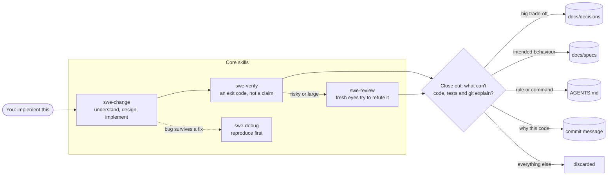

<h1 align="center">swe-harness</h1>

<p align="center"><b>A lean engineering brain for AI coding agents: finish changes properly, prove they work, and remember why.</b></p>

<p align="center">
  <a href="https://github.com/Crypto-Gi/swe-harness/actions/workflows/check.yml"></a>
  <a href="LICENSE"></a>
  
  
  <a href="https://agentskills.io"></a>
</p>



## 🤔 Why

Coding agents are strong, but every session starts from zero and ends with "done!" whether or not it is. Three things go wrong again and again:

- ❌ **"Done" without proof.** The agent says the tests pass; nobody ran them after the last edit.
- 🙈 **The author grades its own work.** The context that wrote the bug explains it away.
- 🧠 **The reasons evaporate.** Why a design was chosen, what was rejected, what the system must keep doing: gone when the session ends.

The usual fixes are heavy: spec frameworks with phase gates, memory databases, agent swarms, generated wikis that go stale. **swe-harness does the opposite.** The model does the engineering; the harness adds only what a strong model cannot give itself.

| | What you get | How |
|---|---|---|
| ✅ | Proof of done | A script records a pass only when the check exits 0 after the last edit |
| 🔍 | Independent review | A fresh context gets the diff and the requirements, never the author's reasoning |
| 🛡️ | No quiet cheating | A guard flags deleted tests, skipped tests and silenced linters |
| 📌 | Memory that stays small | At the end of a change, keep only what code, tests and git can't explain |

Repo structure, symbols, callers and history are looked up from the code when needed and never stored, so they never go stale.

## 🚀 Quick start

```bash
git clone https://github.com/Crypto-Gi/swe-harness && cd swe-harness && ./install.sh
```

Restart your agent, open any code repository and say:

```
bootstrap this project
```

You get a short `AGENTS.md` whose check commands were actually run, a one-line `CLAUDE.md`, and a home for decision records. Then work as usual:

```
add rate limiting to the login endpoint
```

`swe-change` takes it from there: understand, implement, verify, review if it is risky, and file anything worth remembering.

## 📦 Install

`./install.sh` copies the five core skills into `~/.claude/skills` and `~/.agents/skills`, and adds the four lines of [`pointer.md`](pointer.md) to `~/.claude/CLAUDE.md` (and to `~/.codex/AGENTS.md` if you use Codex) as a marked block. The pointer is what makes the skills load: in trials with Sonnet 5.5 the skills fired on 7 of 11 everyday prompts without it and 11 of 11 with it. Your own lines in those files are kept. It needs no network.

<details open>
<summary><b>Claude Code</b> (terminal, IDE, desktop Code tab)</summary>

```bash
git clone https://github.com/Crypto-Gi/swe-harness && cd swe-harness
./install.sh
```

Restart Claude Code, then ask "bootstrap this project".
</details>

<details>
<summary><b>Claude desktop and claude.ai</b></summary>

These apps take skills as uploads, one zip per skill. Ready-made zips are in [`zips/`](zips/).

1. Open a zip on GitHub, starting with [`swe-change.zip`](zips/swe-change.zip), and click **Download raw file**.
2. In the app: **Customize → Skills → + → Upload a skill**, and pick the zip.
3. Repeat for `swe-bootstrap`, `swe-verify`, `swe-review` and `swe-debug`, plus `swe-browser-check` if you build web UIs.

The scripts inside need a session that can run commands on your project files. Paste [`pointer.md`](pointer.md) into your custom instructions too, so the skills load when they should.
</details>

<details>
<summary><b>Codex</b> (CLI, IDE extension, ChatGPT desktop app)</summary>

```bash
git clone https://github.com/Crypto-Gi/swe-harness && cd swe-harness
./install.sh
```

Codex reads skills from `~/.agents/skills` and project rules from `AGENTS.md`. Restart Codex after installing.
</details>

<details>
<summary><b>Devin Desktop (formerly Windsurf) and Devin CLI</b></summary>

```bash
git clone https://github.com/Crypto-Gi/swe-harness && cd swe-harness
./install.sh
```

Both read skills from `~/.agents/skills` and project rules from `AGENTS.md`, root and nested, with no setup. Add [`pointer.md`](pointer.md) to `~/.config/devin/AGENTS.md` so the skills load reliably. Devin Desktop also reads `~/.claude/skills` when its Claude Code compatibility is on. For the cloud agent at app.devin.ai, commit the skills into the repository under `.agents/skills/`, or add them as a Devin plugin.
</details>

<details>
<summary><b>Cursor, Gemini CLI, GitHub Copilot and others</b></summary>

Cursor, Gemini CLI and Copilot also read `~/.agents/skills`, so `./install.sh` covers them. Gemini CLI reads `GEMINI.md` by default; to make it read `AGENTS.md`, add this to `.gemini/settings.json`:

```json
{ "context": { "fileName": ["AGENTS.md", "GEMINI.md"] } }
```

For other agents that support the [Agent Skills](https://agentskills.io) format, the community installer can put the core skills where that agent looks:

```bash
npx skills add Crypto-Gi/swe-harness
```
</details>

<details>
<summary><b>Windows</b></summary>

Run `./install.sh` from Git Bash or WSL, or copy each folder in `skills/` into `%USERPROFILE%\.claude\skills` and `%USERPROFILE%\.agents\skills`. For Claude desktop, use the zips.
</details>

### Custom instructions (optional)

Want the same habits everywhere, even in apps without skills? [`instructions.md`](instructions.md) is one self-contained block you paste into your app's custom instructions: think before coding, keep it small, change surgically, prove it, and remember only what matters. It lists where to paste it for Claude Code, Codex, Claude desktop, ChatGPT and Cursor.

### Optional specialist skills

Install only what a project needs. Third-party skills are downloaded on request, pinned to one upstream commit, and never stored in this repo.

```bash
./install.sh browser     # swe-browser-check: console, network, two screen widths, accessibility
./install.sh security    # swe-security-audit: Cloudflare's security audit (fetched)
./install.sh react       # swe-react: Vercel's React and Next.js rules (fetched)
./install.sh all
```

### Update, check, remove

```bash
git pull && ./install.sh     # update
./install.sh version         # which version is installed
./install.sh uninstall       # remove every skill this repo installed, and the pointer block
```

Pinned skills change only when their commit in [`optional/sources`](optional/sources) changes. What changed between versions is in [`CHANGELOG.md`](CHANGELOG.md).

## 🧰 What's inside

| Skill | What it owns | Say |
|---|---|---|
| [`swe-bootstrap`](skills/swe-bootstrap/SKILL.md) | Sets up a repo: short `AGENTS.md`, `CLAUDE.md` as `@AGENTS.md`, decision-record format | "bootstrap this project" |
| [`swe-change`](skills/swe-change/SKILL.md) | Any code change, start to finish: shapes new ideas, implements, verifies, keeps only what matters, and commits with the README brought up to date | "implement this", "fix this", "continue the work" |
| [`swe-verify`](skills/swe-verify/SKILL.md) | Done is an exit code, and tests must not have been weakened | "is it done", "verify this" |
| [`swe-review`](skills/swe-review/SKILL.md) | A fresh context tries to refute the change; uses Claude Code's `/code-review` where available | "review this" |
| [`swe-debug`](skills/swe-debug/SKILL.md) | Reproduce with one command before theorising; stop after three failed fixes | "debug this" |

**Where project knowledge lives**, and nowhere else:

| Place | Holds |
|---|---|
| `AGENTS.md` | Operating rules and check commands that were run |
| `docs/decisions/` | Significant or hard-to-reverse decisions, and why |
| `docs/specs/` | Intended behaviour, only when code and tests can't carry it |
| `docs/plans/` | Temporary, for multi-session work; deleted at the end |
| Commit messages | Why this implementation |

**Tech stack:** Markdown skills in the [Agent Skills](https://agentskills.io) format, plus four small bash scripts that need only bash, git and awk. No runtime, server or database.

| Script | Does |
|---|---|
| `verified` | Runs a check and records it as passed only on exit 0 |
| `test-guard` | Flags deleted or skipped tests, silenced checkers, removed assertions |
| `review-package` | Writes the diff under review to one file for the reviewer |
| `detect-stack` | Lists stack, workspaces, build tools and candidate check commands |

## 🤝 Works alongside built-in skills

You don't list built-in skills anywhere: each app shows its own skills to the model, and it picks by description. Ours are all named `swe-*`, so none replaces a built-in. Where Claude Code already does the job well, the harness uses it instead of duplicating it:

| Claude Code built-in | How the harness uses it |
|---|---|
| `/code-review` | `swe-review` runs it for bug-finding, then adds what it doesn't check: the change against what you asked for, weakened tests, and a bounded fix loop |
| `/verify`, `/run` | `swe-verify` proves checks pass; `/verify` (you run it) watches the app work. `swe-browser-check` uses `/run` to launch the page |
| `/security-review` | Use it for everyday changes; `swe-security-audit` is for a full codebase audit |
| `/simplify` | Use it to clean up over-built code; the harness has no duplicate |
| `/init` | Use `swe-bootstrap` instead: it writes `AGENTS.md`, which Codex, Cursor and Devin read too. Bootstrap moves anything useful out of an existing `/init` file |
| `/debug` | Unrelated: it debugs Claude Code's session. `swe-debug` is for bugs in your code |

In Codex and other agents, `swe-review` does the whole review itself. Claude desktop's document skills (Word, PDF, slides, spreadsheets) don't overlap and work as before.

Keep the number of installed skills small: the skill list gets about 1% of the context window, and when it overflows, descriptions are cut and skills stop triggering. In Claude Code, `/skill-doctor` shows what each skill costs.

## 🚫 Not included, on purpose

- No hooks, router skill, or anything always loaded beyond skill descriptions and the four-line pointer
- No stored code map, index, graph or wiki
- No tiers, phase gates, task tracker, personas or agent teams
- No language packs: a language needs its check commands, which bootstrap finds and runs

## 🤝 Contributing

Bug reports, ideas and pull requests are welcome: [open an issue](https://github.com/Crypto-Gi/swe-harness/issues).

Every addition has to pass one question: **does it preserve engineering knowledge that can't be derived from code, tests and git, or give feedback a strong model can't give itself?** If not, it stays out. Repo rules are in [`AGENTS.md`](AGENTS.md).

Before opening a pull request:

```bash
./install.sh zip   # if you changed a skill
./check            # skill lint, script tests, zip freshness
eval/run           # if you changed what a skill tells the agent to do (real sessions, costs usage)
```

`eval/run` judges a change by what agents actually do: run it before and after. See [`eval/README.md`](eval/README.md).

## 📄 Licence and credits

Apache-2.0, see [`LICENSE`](LICENSE). Built on ideas and text from [Karpathy-inspired coding guidelines](https://github.com/duolahypercho/andrej-karpathy-skills), [superpowers](https://github.com/obra/superpowers), [mattpocock/skills](https://github.com/mattpocock/skills), [addyosmani/agent-skills](https://github.com/addyosmani/agent-skills), [Cloudflare's security-audit-skill](https://github.com/cloudflare/security-audit-skill), [ponytail](https://github.com/DietrichGebert/ponytail) and [impeccable](https://github.com/pbakaus/impeccable). Every borrowed file, its upstream commit and its licence are in [`SOURCES.md`](SOURCES.md).
